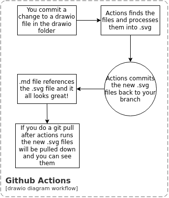
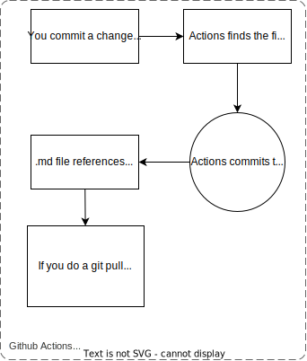

# Draw.io Assets

Draw.io is an open source digraming program that works on Mac, Windows, Linux, Web, and just about anything else.  It is very good ad making diagrams you can control.  Its solves licensing issues caused when diagrams are written in on the OmniGravel or Vizio.
However, Draw.io diagram files are XML and not easily reviewed in a pull request.  Therefore these diagrams should be used sparingly and [Mermaid support for Markdown](https://marketplace.visualstudio.com/items?itemName=bierner.markdown-mermaid) or other text base diagrams should be favored where possible.

You can edit these digrams using the Draw.io application you can download [here](https://github.com/jgraph/drawio-desktop/releases).  You can also directly edit the digrams in VsCode using [this plugin](https://marketplace.visualstudio.com/items?itemName=hediet.vscode-drawio).

There is a [github actions workflow](../.github/workflows/draw.io.yml) in this repo that on push to any branch will process any `*.drawio` file in the drawio folder and output a `.svg` file and a `.png` file. for each page in that file.  The naming of the exported file is `./drawio/export/[file_name.drawio]-[name_of_page].[svg and png].

.svg files are very useful however with the differances in dark mode and transparent backgrounds a .png with a non transparent background can be useful. Actions will output both and you can pick which you want to use based on the usecase. 

To embed a draw.io diagram into a markdown file simply include the exported file as an image tag.  Like this:

### .png example


### .svg exmaple


## Caveats

1. When you do a push, the workflow may update your branch.  This means you should make sure you pull changes before commiting. 
1. Actions will only update the exported files if the source drawio file is changed.
1. Keep in mind if you remove a page from a drawio file actions will not clean up the exported .svg.  You need to do that.
1. These diagrams should be used sparingly and [Mermaid support for Markdown](https://marketplace.visualstudio.com/items?itemName=bierner.markdown-mermaid) or other text base diagrams should be favored where possible. (Yes, I wrote this twice, intentionaly)

## Debuging

If you are having problems and want to do the export your self to see why diagrams are not turning out as you expect you can do that by calling the drawio app directly.  These are the mac instructions.  You need to install the drawio app form [here](https://github.com/jgraph/drawio-desktop/releases)

```shell
alias draw.io='/Applications/draw.io.app/Contents/MacOS/draw.io'
cd ./drawio
draw.io -x -f svg -o test.svg README.drawio
```
This will export the first page of a given file.  The app supports help `draw.io -h`