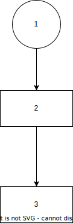

# Draw.io Assets

Draw.io is an open source diagraming program that works on Mac, Windows, Linux, Web, and just about anything else.  It is very good ad making diagrams you can control.  Its solves licensing issues caused when diagrams are written in on the OmniGravel or Vizio.

To work with these files, you will want this VSCode [plugin](https://marketplace.visualstudio.com/items?itemName=hediet.vscode-drawio).

You can now directly edit drawio diagrams and directly imbed them in your markdown files.  To do this just create a file named `file.drawio.svg` and edit it.  Read about this feature [here](https://www.diagrams.net/blog/embed-diagrams-vscode)

If you are running in Dark Mode in VSCode or on your browser, you may not get the result you expect.
To fix this I use the Atlas style for draw.io.  You can use the [.vscode/settings](../.vscode/settings.json) to set this or set it on the extensions settings.  Then you want to set a white background on your diagram.

To include it in markdown just use a standard image tag.  This is an example.

## Example

This works for github pages as well but because of path translations you need to keep the drawio file in the same folder as the markdown.

TODO: Figure out github pages and how I can apply [this](https://github.com/jgraph/drawio-github) style so that I dont have to play with dark mode.
