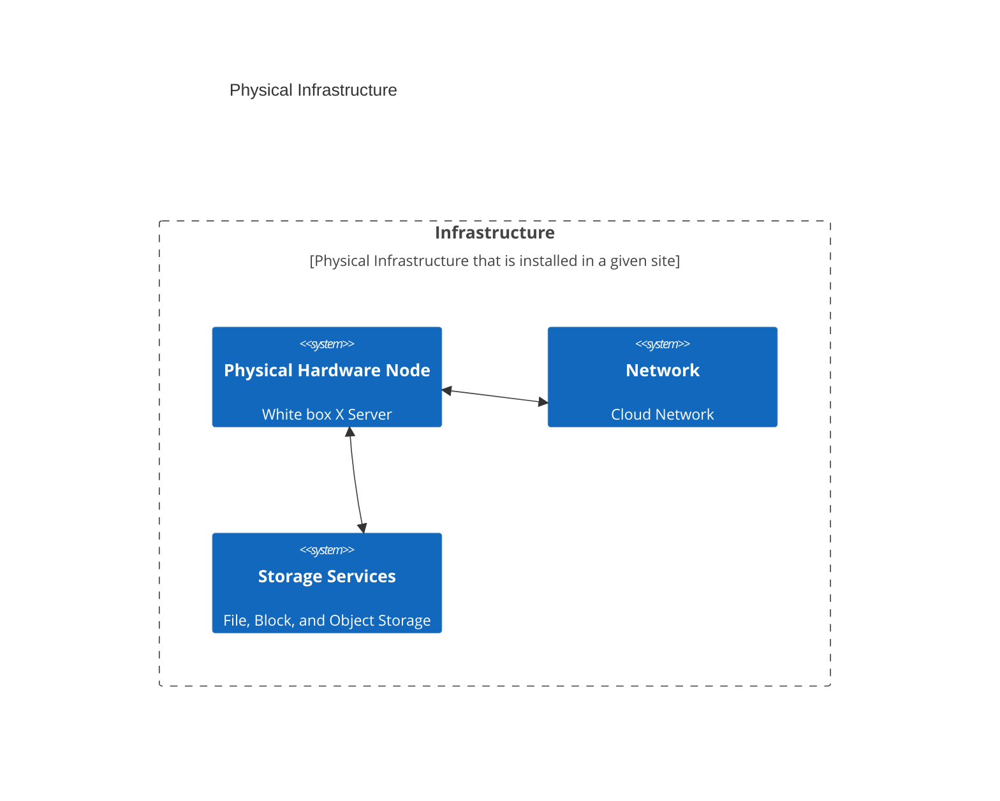
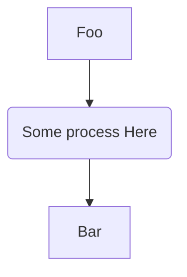
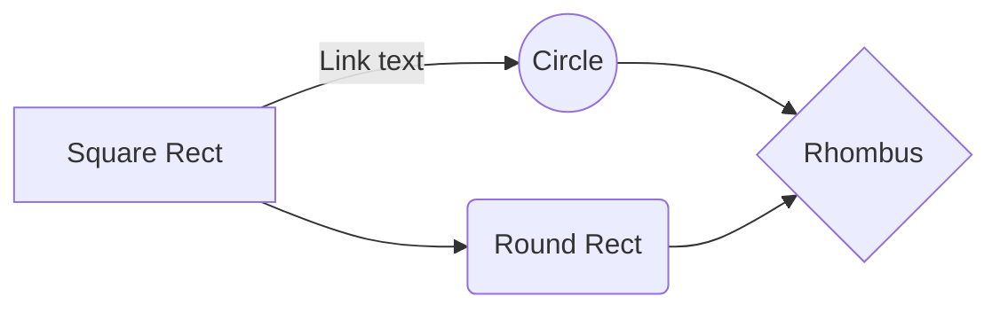
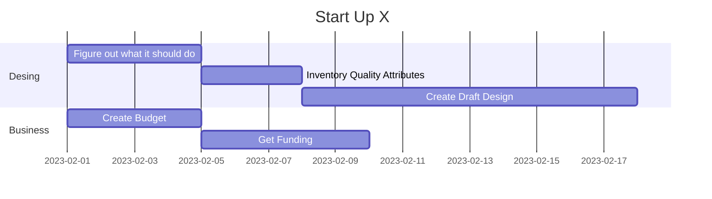
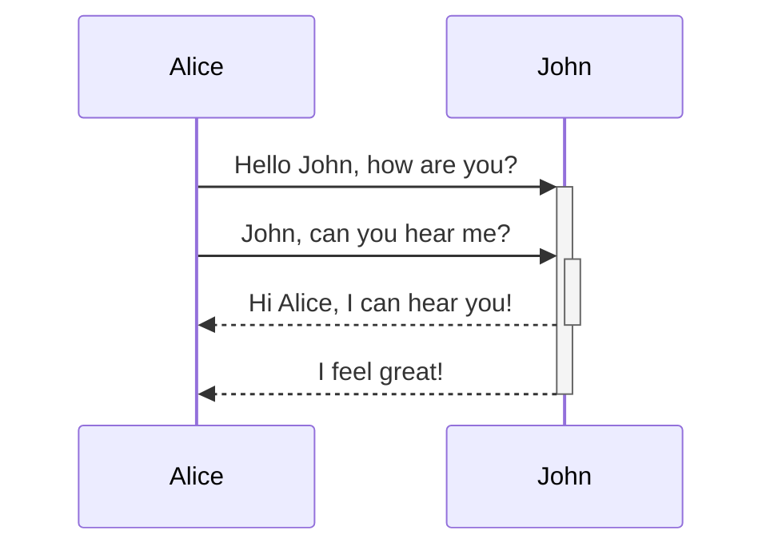
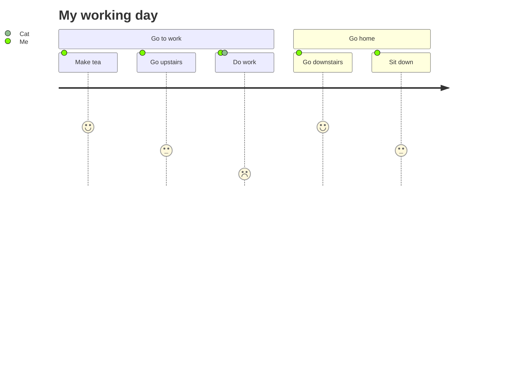
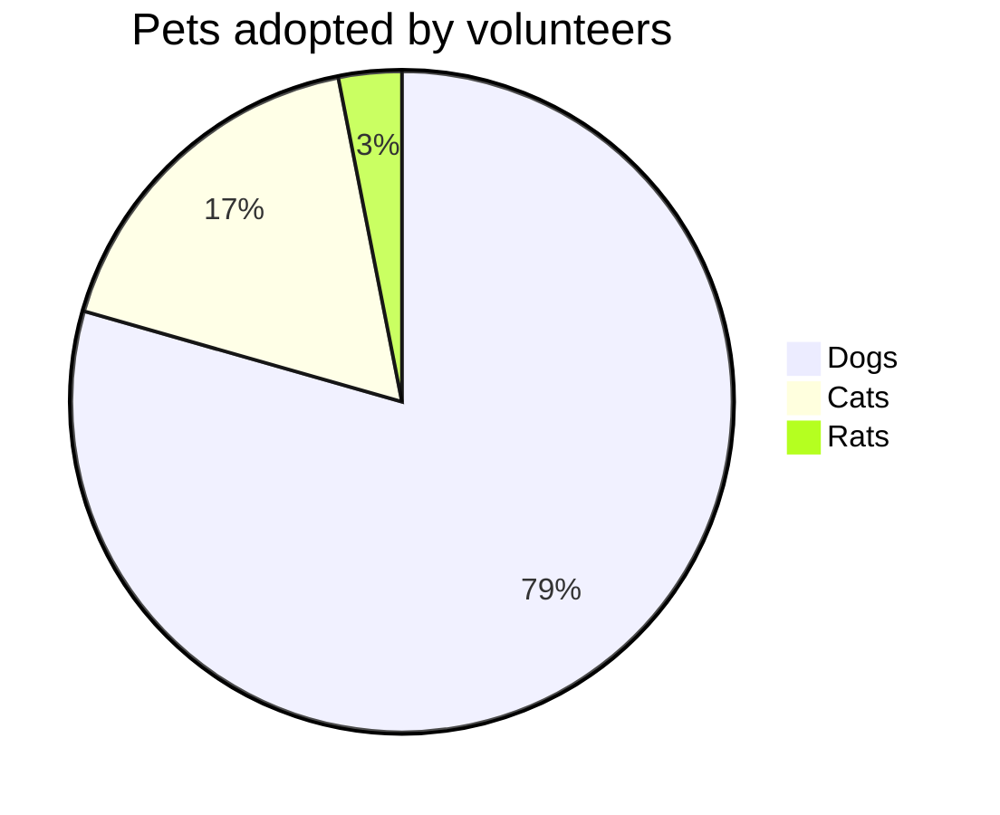

# Mermaid

[Mermaid](https://mermaid.js.org/intro/) graphs in the Markdown are automatically rendered into embedded diagrams in markdown files by the github enterprise [GitHub’s HTML pipeline](https://github.blog/2022-02-14-include-diagrams-markdown-files-mermaid/).  This means that embed Mermaid diagrams in a .md file will be converted into a graph when pushed to github.  You can also see how they will be rendered localy using the [Mermaid support for Markdown](https://marketplace.visualstudio.com/items?itemName=bierner.markdown-mermaid) for VsCode.  


## Resources

- [https://mermaid.live/edit](Online live editor).  Just use the editor then copy and paste it in your mark down file.  I used this tool to get some of the examples below.
- [Mermaid Cheat Sheet](https://jojozhuang.github.io/tutorial/mermaid-cheat-sheet/).  I used this to get some of the examples below.


## Examples

### C4

This is a simple example of the built in C4 support




### Flow Chart

The below shows the flow of foo to bar 



And this flow shows Left to Right



### Schedule

You can use headers as anchors you can deep link to a diagram in github. 



Its helpful to add context right in your markdown next to a diagram



### Journey



### Pie



# Debuging

If there are erros rendering localy or in github it can be useful to render the mermaid diagram localy.  To do that you can use the mmdc app.

```shell
# Mac Instructions 
# TODO: I think docker is a better way to do this.  Maybe both should be documented here?)

# If you dont have brew installed go get it. https://brew.sh/
# Then install npm (Node Package Manager) if you dont have that.
brew install npm

# Use npm to install the mermaid cli
npm install -g @mermaid-js/mermaid-cli

# Use the mermaid cli to process the diagram.  It will output a svg and a new markdown file that 
# will contain a link to the svg via an image.  Read about it here: https://github.com/mermaid-js/mermaid-cli
mmdc -i domain_view.md -o domain_view_out.md

# TODO: Windows instructions?  If you want them feel free to contribute.  :)
```
